# 1、基础数据准备

创建表并初始化一些基础数据，便于后面SQL优化时使用，tbl_user用户表，tbl_userinfo用户详情表。

```go
DROP TABLE IF EXISTS `user`;
CREATE TABLE `user` (
	`id` INT ( 11 ) NOT NULL AUTO_INCREMENT,
	`username` VARCHAR ( 255 ) DEFAULT NULL,
	`email` VARCHAR ( 20 ) DEFAULT NULL,
	`age` TINYINT ( 4 ) DEFAULT NULL,
	`type` INT ( 11 ) DEFAULT NULL,
	`create_time` datetime DEFAULT NULL,
PRIMARY KEY ( `id` )) ENGINE = INNODB AUTO_INCREMENT = 10 DEFAULT CHARSET = utf8;
INSERT INTO `user` VALUES
	( '1', 'admin', 'admin@126.com', '18', '1', '2018-07-09 11:08:57' ),
	( '2', 'mengday', 'mengday@163.com', '31', '2', '2018-07-09 11:09:00' ),
	( '3', 'mengdee', 'mengdee@163.com', '20', '2', '2018-07-09 11:09:04' ),
	( '4', 'root', 'root@163.com', '31', '1', '2018-07-09 14:36:19' ),
	( '5', 'zhangsan', 'zhangsan@126.com', '20', '1', '2018-07-09 14:37:28' ),
	( '6', 'lisi', 'lisi@gmail.com', '20', '1', '2018-07-09 14:37:31' ),
	( '7', 'wangwu', 'wangwu@163.com', '18', '1', '2018-07-09 14:37:34' ),
	( '8', 'zhaoliu', 'zhaoliu@163.com', '22', '1', '2018-07-11 18:29:24' ),
	( '9', 'fengqi', 'fengqi@163.com', '19', '1', '2018-07-11 18:29:32' );


DROP TABLE IF EXISTS `userinfo`;
CREATE TABLE `userinfo` (
	`id` INT ( 11 ) NOT NULL AUTO_INCREMENT,
	`address` VARCHAR ( 255 ) DEFAULT NULL,
	`user_id` INT ( 11 ) DEFAULT NULL,
	PRIMARY KEY ( `id` ),
UNIQUE KEY `idx_userId` ( `user_id` )) ENGINE = INNODB AUTO_INCREMENT = 7 DEFAULT CHARSET = utf8;

INSERT INTO `userinfo` VALUES
	( '1', '上海市', '1' ),
	( '2', '北京市', '2' ),
	( '3', '杭州', '3' ),
	( '4', '深圳', '4' ),
	( '5', '广州', '5' ),
	( '6', '海南', '6' );
```


# 2、插入数据

五百万数据插入上面插入几条测试数据，在使用索引时还需要插入更多的数据作为测试数据，下面就通过存储过程插入500W条数据作为测试数据

```go
-- 修改mysql默认的结束符号，默认是分号；但是在函数和存储过程中会使用到分号导致解析不正确
delimiter $$

-- 随机生成一个指定长度的字符串
create function rand_string(n int) returns varchar(255) begin 

DECLARE chars_str VARCHAR ( 100 ) DEFAULT 'abcdefghijklmnopqrstuvwxyzABCDEFJHIJKLMNOPQRSTUVWXYZ';
DECLARE
	return_str VARCHAR ( 255 ) DEFAULT '';
DECLARE
	i INT DEFAULT 0;
WHILE
		i < n DO
		
		SET return_str = concat(
			return_str,
		substring( chars_str, floor( 1+rand ()* 52 ), 1 ));
	
	SET i = i + 1;
	
END WHILE;
RETURN return_str;

END $$

-- 创建插入的存储过程
CREATE PROCEDURE insert_user (
	IN START INT ( 10 ),
	IN max_num INT ( 10 )) BEGIN
	DECLARE
		i INT DEFAULT 0;
	
	SET autocommit = 0;
	REPEAT
			
			SET i = i + 1;
		INSERT INTO user
		VALUES
			((
					START + i 
					),
				rand_string ( 8 ),
				concat( rand_string ( 6 ), '@random.com' ),
				1+FLOOR ( RAND()* 100 ),
				3,
			now());
		UNTIL i = max_num 
	END REPEAT;
	COMMIT;

END $$

-- 将命令结束符修改回来
delimiter ;

-- 调用存储过程，插入500万数据，需要等待一会时间，等待执行完成
call insert_user(100001,5000000);
```


# 3、 查看索引使用情况

## 1、无索引情况

```go
select * from user where username = 'fBshKeqs'
```

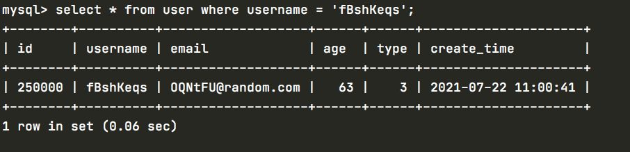


创建索引，然后再查询可以看到耗时0.00秒，这就是索引的威力

```go
create index idx_username on user(username);
```

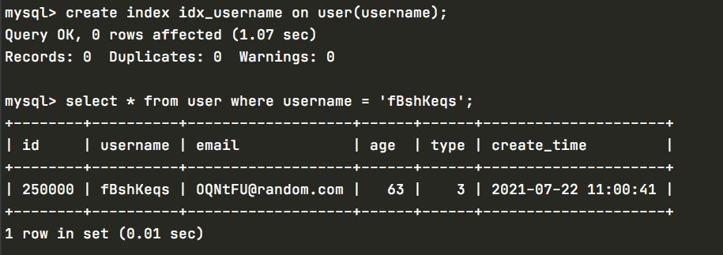


查看索引情况

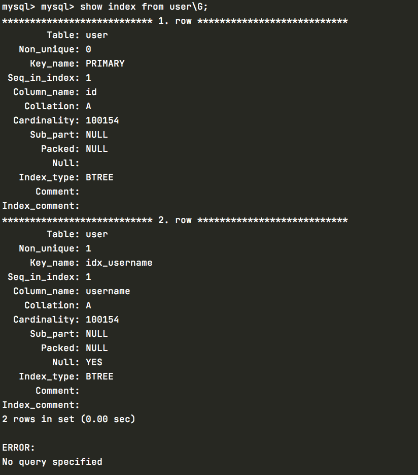

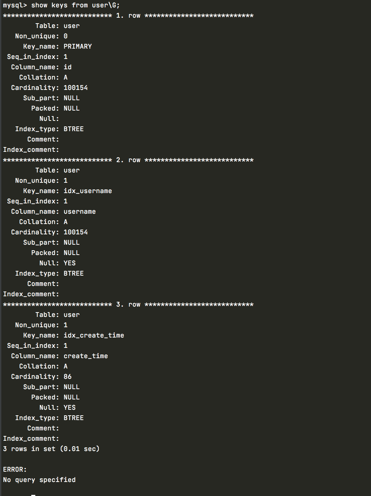


# 4、explain命令

```go
explain select * from user where username = 'fBshKeqs'\G;

mysql> explain select * from user where username = 'fBshKeqs'\G;
*************************** 1. row ***************************
           id: 1
  select_type: SIMPLE
        table: user
   partitions: NULL
         type: ref
possible_keys: idx_username
          key: idx_username
      key_len: 768
          ref: const
         rows: 1
     filtered: 100.00
        Extra: NULL
1 row in set, 1 warning (0.01 sec)

ERROR: 
No query specified

```


```go
explain select * from user where id =1
    -> ;
+----+-------------+-------+------------+-------+---------------+---------+---------+-------+------+----------+-------+
| id | select_type | table | partitions | type  | possible_keys | key     | key_len | ref   | rows | filtered | Extra |
+----+-------------+-------+------------+-------+---------------+---------+---------+-------+------+----------+-------+
|  1 | SIMPLE      | user  | NULL       | const | PRIMARY       | PRIMARY | 4       | const |    1 |   100.00 | NULL  |
+----+-------------+-------+------------+-------+---------------+---------+---------+-------+------+----------+-------+
1 row in set, 1 warning (0.01 sec)
```


```go
mysql> explain select * from user where username="admin" 
    -> union
    -> select * from user where email ="admin@163.com";

*************************** 1. row ***************************
           id: 1
  select_type: PRIMARY
        table: user
   partitions: NULL
         type: ref
possible_keys: idx_username
          key: idx_username
      key_len: 768
          ref: const
         rows: 1
     filtered: 100.00
        Extra: NULL
*************************** 2. row ***************************
           id: 2
  select_type: UNION
        table: user
   partitions: NULL
         type: ALL
possible_keys: NULL
          key: NULL
      key_len: NULL
          ref: NULL
         rows: 100154
     filtered: 10.00
        Extra: Using where
*************************** 3. row ***************************
           id: NULL
  select_type: UNION RESULT
        table: <union1,2>
   partitions: NULL
         type: ALL
possible_keys: NULL
          key: NULL
      key_len: NULL
          ref: NULL
         rows: NULL
     filtered: NULL
        Extra: Using temporary
3 rows in set, 1 warning (0.00 sec)

ERROR: 
No query specified
```

explain命令用于查看sql执行时是否使用了索引，是优化SQL语句的一个非常常用而且非常重要的一个命令, 上面中的key字段表示查询使用到的索引即使用了idx_username索引

- id: SELECT识别符。这是SELECT的查询序列号
- select_type: 查询类型simple: 简单表即不适用表连接或者子查询primary: 主查询，即外层的查询subquery: 子查询内层第一个SELECT，结果不依赖于外部查询dependent subquery: 子查询内层第一个select: 依赖于外部查询union: UNION语句中第二个SELECT开始后面所有SELECTunion result union 中合并结果DERIVED
- table：查询的表
- partitions
- type：扫描的方式，all表示全表扫描all : 全表扫描index: 扫描所有索引range: 索引范围扫描,常见于< <=、>、>=、between、const: 表最多有一个匹配行, 常见于根据主键或唯一索引进行查询system: 表仅有一行(=系统表)。这是const联接类型的一个特例ref
- possible_keys: 该查询可以利用的索引，可能同一个查询有多个索引可以使用，如果没有任何索引显示null
- key: 实际使用到的索引，从Possible_key中所选择使用索引，当有多个索引时，mysql会挑出一个最优的索引来使用
- key_len: 被选中使用索引的索引长度 ==null一个字符== 、==可变未两个字符==
- ref:多表连接时的外键字段const
- rows: 估算出结果集行数，该sql语句扫描了多少行，可能得到的结果,MySQL认为它执行查询时必须检查的行数
- filtered:
- Extra： 额外重要的信息no tables: Query语句中使用FROM DUAL 或不含任何FROM子句using filesort : 使用文件排序，最好能避免这种情况Using temporary: 某些操作必须使用临时表，常见 GROUP BY ; ORDER BYUsing where: 不用读取表中所有信息，仅通过索引就可以获取所需数据;Using join buffer (Block Nested Loop)Using index conditionUsing sort_union(索引名)

# 5、查看索引的使用情况

```go
mysql> show status like 'Handler_read%';
+-----------------------+--------+
| Variable_name         | Value  |
+-----------------------+--------+
| Handler_read_first    | 2      |
| Handler_read_key      | 4      |
| Handler_read_last     | 0      |
| Handler_read_next     | 1      |
| Handler_read_prev     | 0      |
| Handler_read_rnd      | 0      |
| Handler_read_rnd_next | 200062 |
+-----------------------+--------+
7 rows in set (0.01 sec)

```

- Handler_read_first : Handler_read_first
- Handler_read_key : 根据键读取一行的请求数。此选项数值如果很高，那么恭喜你，你的系统高效的使用了索引，一切运转良好
- Handler_read_last : 根据键读取最后一行的请求数。
- Handler_read_prev : 根据键顺序读前一行的请求数。该读取方式主要用于优化`ORDER BY ... DESC`。
- Handler_read_rnd : 根据固定位置读一行的请求数。如果你正执行大量查询并需要对结果进行排序该值较高，那么你可能使用了大量全表扫的的查询或你的连接没有正确使用索引。
- Handler_read_rnd_next : 在数据文件中读下一行的请求数。如果你正在进行大量的表扫描，该值较高。通常说明你的表索引不正确或写的语句没有利用到索引。
- Handler_rollback : ROLLBACK语句的数量
- Handler_update : 更新表中一行数据的次数。
- Handler_write : 插入一行数据的次数。


查询优化器：

- 重新定义表的关联顺序(优化器会根据统计信息来决定表的关联顺序)
- 将外连接转化成内连接(当外连接等于内连接)
- 使用等价变换规则（如去掉1=1）
- 优化count()、min()、max()
- 子查询优化
- 提前终止查询
- in条件优化

==mysql可以通过 EXPLAIN EXTENDED 和 SHOW WARNINGS 来查看mysql优化器改写后的sql语句==

```go
mysql> explain extended
    -> select id,username from user where 1=1 and email='admin@163.com';
+----+-------------+-------+------------+------+---------------+------+---------+------+--------+----------+-------------+
| id | select_type | table | partitions | type | possible_keys | key  | key_len | ref  | rows   | filtered | Extra       |
+----+-------------+-------+------------+------+---------------+------+---------+------+--------+----------+-------------+
|  1 | SIMPLE      | user  | NULL       | ALL  | NULL          | NULL | NULL    | NULL | 100154 |    10.00 | Using where |
+----+-------------+-------+------------+------+---------------+------+---------+------+--------+----------+-------------+
1 row in set, 2 warnings (0.03 sec)

mysql> show WARNINGS;
+---------+------+----------------------------------------------------------------------------------------------------------------------------------------------------------------+
| Level   | Code | Message                                                                                                                                                        |
+---------+------+----------------------------------------------------------------------------------------------------------------------------------------------------------------+
| Warning | 1681 | 'EXTENDED' is deprecated and will be removed in a future release.                                                                                              |
| Note    | 1003 | /* select#1 */ select `test2`.`user`.`id` AS `id`,`test2`.`user`.`username` AS `username` from `test2`.`user` where (`test2`.`user`.`email` = 'admin@163.com') |
+---------+------+----------------------------------------------------------------------------------------------------------------------------------------------------------------+
2 rows in set (0.00 sec)
```

# 6、走索引和不走索引的情况

## 1、in走索引

n操作能避免则避免，若实在避免不了，需要仔细评估in后边的集合元素数量，控制在1000个之内。

==超过一定数量，就不会走索引了==

```go
mysql> explain select * from user where username IN('admin','root')\G;
*************************** 1. row ***************************
           id: 1
  select_type: SIMPLE
        table: user
   partitions: NULL
         type: range
possible_keys: idx_username
          key: idx_username
      key_len: 768
          ref: NULL
         rows: 2
     filtered: 100.00
        Extra: Using index condition
1 row in set, 1 warning (0.00 sec)

ERROR: 
No query specified
```

是走了索引的

## 2、范围查找走索引

```go
mysql> explain select * from user where create_time > '2021-07-22 11:04:05' and create_time < '2021-07-22 11:04:22'\G;
*************************** 1. row ***************************
           id: 1
  select_type: SIMPLE
        table: user
   partitions: NULL
         type: range
possible_keys: idx_create_time
          key: idx_create_time
      key_len: 6
          ref: NULL
         rows: 1
     filtered: 100.00
        Extra: Using index condition
1 row in set, 1 warning (0.00 sec)

ERROR: 
No query specified
```


## 3、模糊查询只有左前缀使用索引

```go
mysql> explain select * from user where username like "admi%"\G;
*************************** 1. row ***************************
           id: 1
  select_type: SIMPLE
        table: user
   partitions: NULL
         type: range
possible_keys: idx_username
          key: idx_username
      key_len: 768
          ref: NULL
         rows: 1
     filtered: 100.00
        Extra: Using index condition
1 row in set, 1 warning (0.01 sec)

ERROR: 
```

==左模糊使用索引==

```go
mysql> explain select * from user where username like "dmin%"\G;
*************************** 1. row ***************************
           id: 1
  select_type: SIMPLE
        table: user
   partitions: NULL
         type: range
possible_keys: idx_username
          key: idx_username
      key_len: 768
          ref: NULL
         rows: 1
     filtered: 100.00
        Extra: Using index condition
1 row in set, 1 warning (0.00 sec)

ERROR: 
No query specified

```

==右后缀也使用了索引==

```go
mysql> explain select * from user where username like "%dmin%"\G;
*************************** 1. row ***************************
           id: 1
  select_type: SIMPLE
        table: user
   partitions: NULL
         type: ALL
possible_keys: NULL
          key: NULL
      key_len: NULL
          ref: NULL
         rows: 100154
     filtered: 11.11
        Extra: Using where
1 row in set, 1 warning (0.01 sec)

ERROR: 
No query specified
```

==左右匹配不会走索引==

## 4、反向条件不走索引 != 、 <> 、 NOT IN、IS NOT NULL

```go
mysql> explain select * from user where username != "admin"\G;
*************************** 1. row ***************************
           id: 1
  select_type: SIMPLE
        table: user
   partitions: NULL
         type: ALL
possible_keys: idx_username
          key: NULL
      key_len: NULL
          ref: NULL
         rows: 100154
     filtered: 50.44
        Extra: Using where
1 row in set, 1 warning (0.00 sec)

ERROR: 
No query specified

mysql> explain select * from user where username <> "admin"\G;
*************************** 1. row ***************************
           id: 1
  select_type: SIMPLE
        table: user
   partitions: NULL
         type: ALL
possible_keys: idx_username
          key: NULL
      key_len: NULL
          ref: NULL
         rows: 100154
     filtered: 50.44
        Extra: Using where
1 row in set, 1 warning (0.00 sec)

ERROR: 
No query specified

mysql> explain select * from user where username NOT IN ("admin")\G;
*************************** 1. row ***************************
           id: 1
  select_type: SIMPLE
        table: user
   partitions: NULL
         type: ALL
possible_keys: idx_username
          key: NULL
      key_len: NULL
          ref: NULL
         rows: 100154
     filtered: 50.44
        Extra: Using where
1 row in set, 1 warning (0.00 sec)

ERROR: 
No query specified

mysql> explain select * from user where username IS NOT NULL;
+----+-------------+-------+------------+------+---------------+------+---------+------+--------+----------+-------------+
| id | select_type | table | partitions | type | possible_keys | key  | key_len | ref  | rows   | filtered | Extra       |
+----+-------------+-------+------------+------+---------------+------+---------+------+--------+----------+-------------+
|  1 | SIMPLE      | user  | NULL       | ALL  | idx_username  | NULL | NULL    | NULL | 100154 |    50.00 | Using where |
+----+-------------+-------+------------+------+---------------+------+---------+------+--------+----------+-------------+
1 row in set, 1 warning (0.01 sec)

mysql> 

```

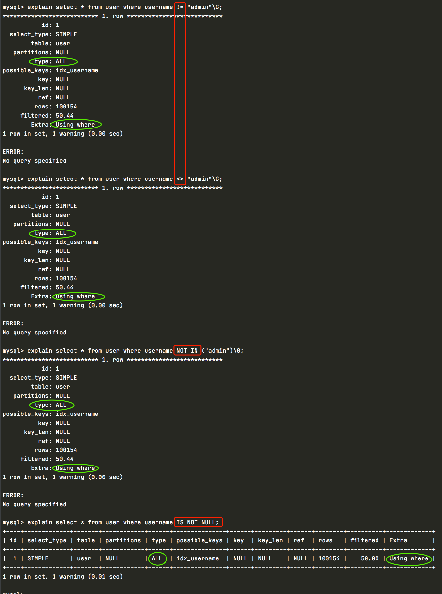


常见的对not in的优化，使用左连接加上is null的条件过滤

```go
SELECT
	id,
	username,
	age 
FROM
	tbl_user 
WHERE
	id NOT IN ( SELECT user_id FROM tbl_order );

SELECT
	u.id,
	u.username,
	u.ageFROM tbl_user u
LEFT JOIN tbl_order o ON u.id = o.user_id WHERE o.user_id IS NULL;
```


## 5、条件计算不走索引(函数或者所属表达式)不走索引

使用函数计算不走索引，无论是对字段使用了函数还是值使用了函数都不走索引，解决办法通过应用程序计算好，将计算的结果传递给sql，而不是让数据库去计算

```go
mysql> explain select * from user where length(username) <=6;
+----+-------------+-------+------------+------+---------------+------+---------+------+--------+----------+-------------+
| id | select_type | table | partitions | type | possible_keys | key  | key_len | ref  | rows   | filtered | Extra       |
+----+-------------+-------+------------+------+---------------+------+---------+------+--------+----------+-------------+
|  1 | SIMPLE      | user  | NULL       | ALL  | NULL          | NULL | NULL    | NULL | 100154 |   100.00 | Using where |
+----+-------------+-------+------------+------+---------------+------+---------+------+--------+----------+-------------+
1 row in set, 1 warning (0.03 sec)

mysql> explain select * from user where create_time < NOW();
+----+-------------+-------+------------+------+-----------------+------+---------+------+--------+----------+-------------+
| id | select_type | table | partitions | type | possible_keys   | key  | key_len | ref  | rows   | filtered | Extra       |
+----+-------------+-------+------------+------+-----------------+------+---------+------+--------+----------+-------------+
|  1 | SIMPLE      | user  | NULL       | ALL  | idx_create_time | NULL | NULL    | NULL | 100154 |    50.00 | Using where |
+----+-------------+-------+------------+------+-----------------+------+---------+------+--------+----------+-------------+
1 row in set, 1 warning (0.03 sec)

mysql> explain select * from user where id/10=1;
+----+-------------+-------+------------+------+---------------+------+---------+------+--------+----------+-------------+
| id | select_type | table | partitions | type | possible_keys | key  | key_len | ref  | rows   | filtered | Extra       |
+----+-------------+-------+------------+------+---------------+------+---------+------+--------+----------+-------------+
|  1 | SIMPLE      | user  | NULL       | ALL  | NULL          | NULL | NULL    | NULL | 100154 |   100.00 | Using where |
+----+-------------+-------+------------+------+---------------+------+---------+------+--------+----------+-------------+
1 row in set, 1 warning (0.00 sec)
```

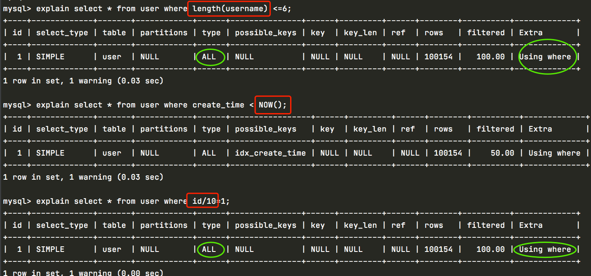


## 6、查询时候必须使用正确的数据类型

- 避免 ‘1’ 用 1查询
- 而 1 时可以用‘1’查询，用到索引


## 7、==or 只有两边都有索引才走索引，如果都没有或者只有一个不走索引==


如果or的一个索引比扫描全表的消耗大，会导致两个索引都不走

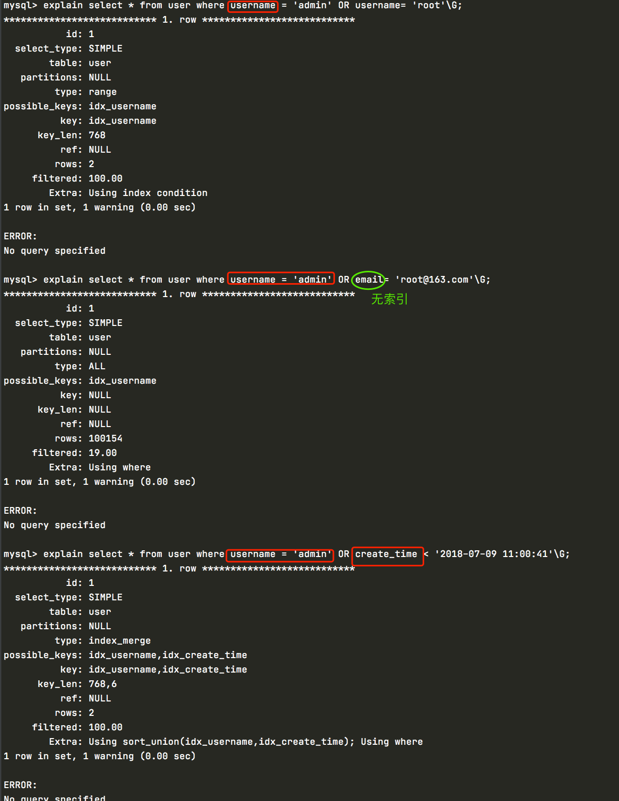


## 8、用union少用or

尽量避免使用or，因为大部分or连接的两个条件同时都进行索引的情况几率比较小，应使用uninon代替，这样能走索引的走索引，不能走索引的就全表扫描。


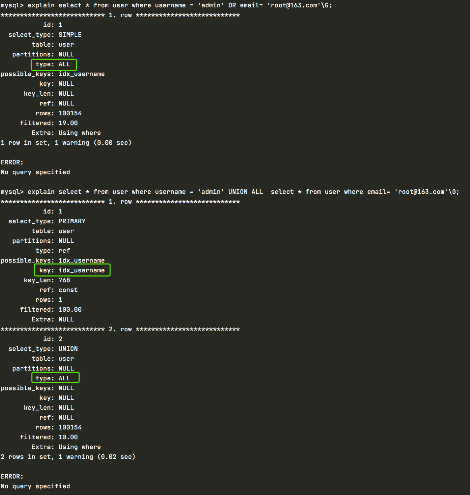


union all 一个走了索引,or中的一个没有索引导致全部没走索引


## 9、能用union all就不用union

==union all 不做去重==

==union 做去重操作，会临时表去重==

```go
explain select * from user where username = 'admin' UNION ALL  select * from user where email= 'root@163.com'\G;
```


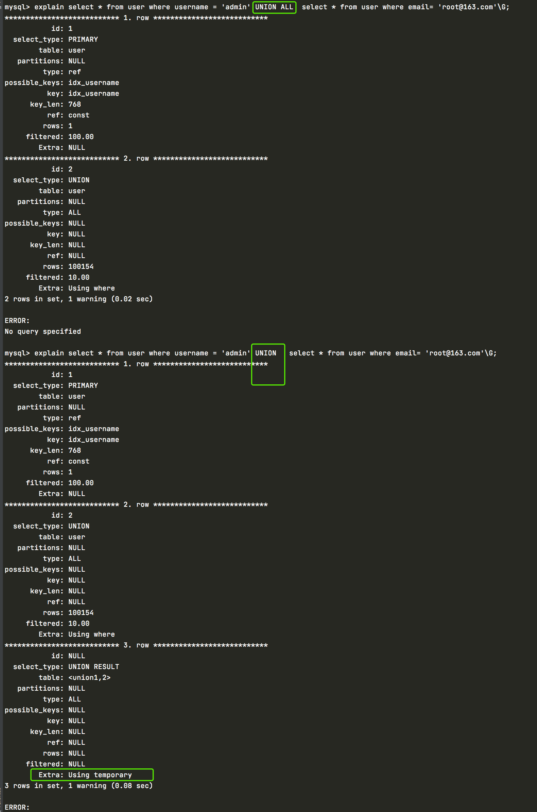


## 10、复合索引

应该遵循最左原则


## 11、索引覆盖

索引覆盖指的是当要查询的字段（值where group by、order by的字段）在索引列都可以找到，就不会回表走主键索引去获取相应字段

mysql是innodb的聚簇索引，费主键索引存储的是主键的主键id，主键的叶子结点存储的数据，并且是首尾相连的双向链表


## 12、order by

mysql 有两种排序方式：

- 通过有序索引顺序扫描直接返回所有数据，通过explain分析显示Using Index，不需要额外的排序，操作效率比较高
- 通过返回数据进行排序，也就是filrSort排序，所有不是通过索引直接返回的排序结果的都叫filesort排序，filesort是通过相应的排序算法将取得的数据在sort_buffer_sizex系统变量 设置的内存中进行排序，如果内存装载不下，就会将磁盘的数据进行相应的分块，在对各个数据进行排序，合成有序数据返回

==order by使用索引的严格性==

- 索引的数据和order by子句的顺序完全一致--联合索引
- 索引中所有列的方向（生序、降序）和order by必须完全一致--联合索引
- <font color=red >**当多表连接查询的时候order by中的字段必须在关联表中的第一张表**</font>
- 如果是单独两个索引是用不到排序的

如果有order by的场景，请注意利用索引的有序性，order by最后的字段是组合索引的一部分，并且放在组合索引的最后，避免出现filesort的情况

正

```go
where a= ? and b= ? order by c
```

反

索引中有范围查找，那么索引的有序性无法利用

```go
where a > 10 order by b
索引ab无法排序
```

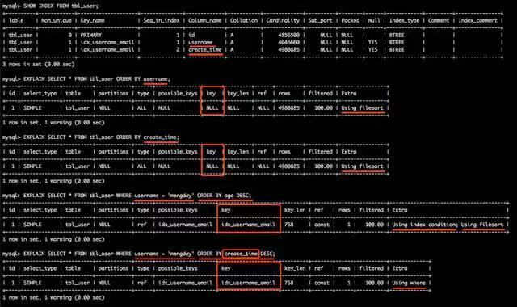


order by 如果根据多个值进行排序，那么排序方式必须保持一致，要么同时生序，要么同时降序，排序方式不一致不走索引

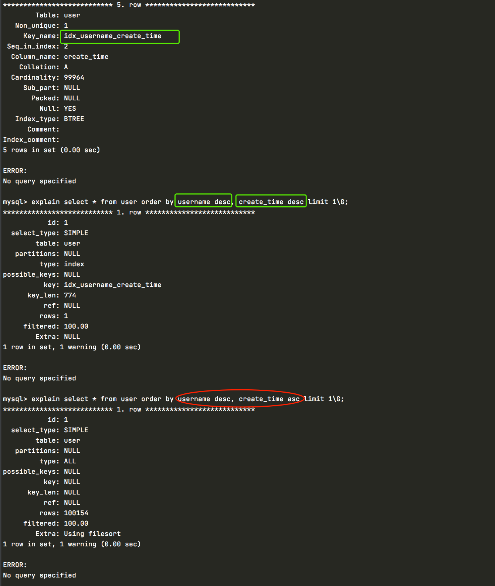


单独的两个索引是用不到索引的

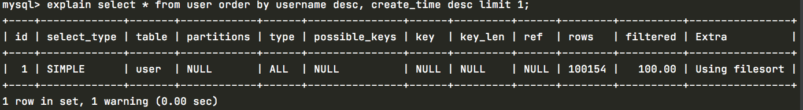


## 13、group by

group by column

- 第一个是根据指定的列进行分组，而且还为分组中的数据按照列来进行排序，如果分组的数据创建了索引，那么排序也没什么
- 如果group by指定的列没有走索引，而我们只要对分组中的数据求和，通常顺序没有关系，那么我们应该关闭group by的排序功能，避免排序造成的性能消耗

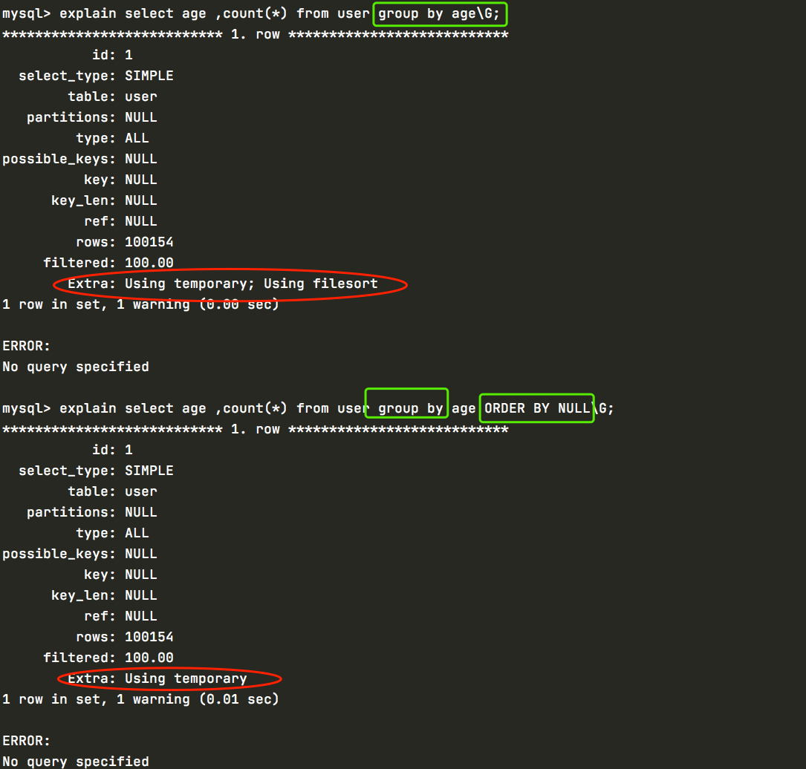


## 14、分页limit

分页优化的两种思路

- 第一种思路，在索引上完成排序和分页动作，最后根据主键关联回原表查询原来所需要的其他列，这种思路是使用覆盖索引尽快确定要查询的记录的id。

- 第二种思路 limit m ，n 转化为 limit n

  分页一般是page 和limit，page时叶黄素，limit时每次的条数，记录最后的lastrowid，每次在分页的时候过滤lastrowid之前的数据，然后再去挑记录


## 15、in和exists

**外表大用in，比exists快，但是内表大并没有很明显的exists比in快**

mysql中exists和in的区别有：

- in是把外表和内表做hash连接，先查询内表；
- exists是对外表做loop循环，循环后在对内表查询；
- 在外表大的时用in效率更快，内表大用exists更快。

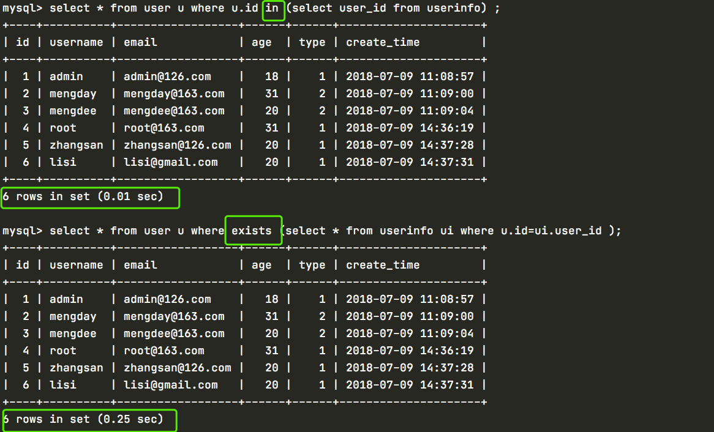


==外表大==

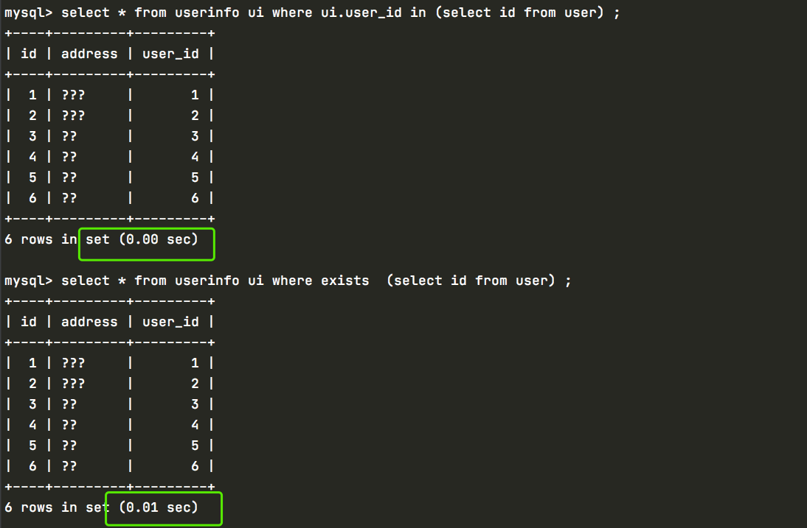


## 16、强制索引

强制走主键

PRI时索引名称

```go
 select * from user force index(PRI);
```

禁止使用某个索引

```go
select * from user ignore index(PRI);
```

