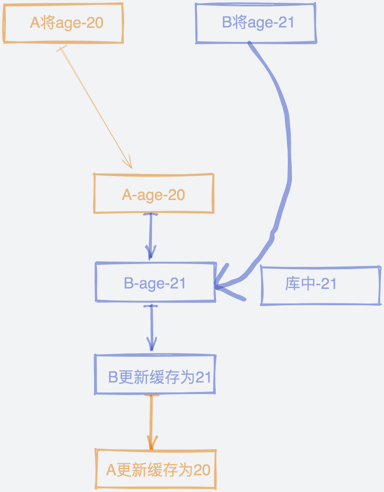
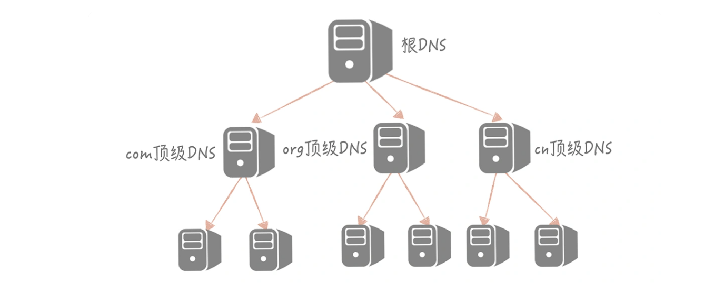
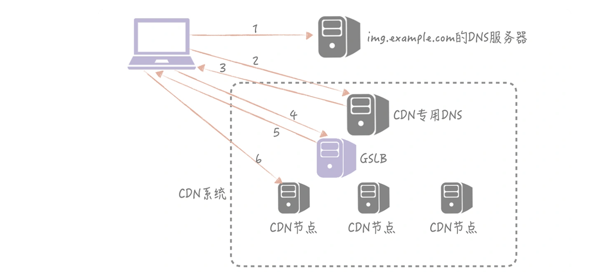

提到高并发系统，首先我们就会想到下面这几个点
- 数据库优化
- 增加缓存
- 异步处理
- 静态资源CDN加速

但是其中的每个细节要怎么处理呢？

# 1、数据库优化
## 池化连接
 为了频繁的创建mysql连接所造成的消耗，我们会将mysql连接进行池化存储，有效的减少程序连接数据库造成的消耗，同时减轻mysql的压力

## 合理的建立库表
 1. 我们对于频繁更新的数据，尽量区分出来，防止频繁的更新等待innoDB的行锁和间隙锁造成的并发下降，同时合理的创建索引。
 2. 数据量达到一定程度，根据业务进行合理的分库分表。
 3. 冷热数据做到合理分表

# 2、缓存优化
## 选择合理的缓存策略
 1. 旁路缓存策略（Cache Aside）
    - 操作数据的时候,先更新数据库，在删除缓存

    为什么不更新而是删除缓存？

    - A请求更新数据库age字段为18更新数据库，B请求将age更新为19岁，更新缓存，但是B的更新操作在A的中间，组后缓存的数据是20，造成库和缓存数据不一致

      

     会造成缓存和数据库数据不一致，因为数据库操作和缓存操作不是一个原子性的操作，如果我们做一个分布式锁，更新完数据库在更新完缓存，然后释放锁，未尝不可，但是这样不如降低并发的成本是很高的，和缓存提高吞吐相悖。

    

    那我们要如何解决这个问题呢？其实，我们可以在更新数据时不更新缓存，而是删除缓存中的数据，在读取数据时，发现缓存中没了数据之后，再从数据库中读取数据，更新到缓存中。

    

    可不可以先删除在更新数据库？

    - 数据age的值在库中是20，A要更新age为21，先删除缓存，B请求发现缓存没有，查询age为20，此时A更新age为21，造成了读取的和库中的数据不一致

    后删除缓存是否有缺点？

    - A读取age为20，在未写入缓存的时候，请求B更新age为21，A更新缓存为20，造成了不一致

    Cache Aside 存在的最大的问题是当写入比较频繁时，缓存中的数据会被频繁地清理，这样会对缓存的命中率有一些影响。如果你的业务对缓存命中率有严格的要求，那么可以考虑两种解决方案：

    1. 一种做法是在更新数据时也更新缓存，只是在更新缓存前先加一个分布式锁，因为这样在同一时间只允许一个线程更新缓存，就不会产生并发问题了。当然这么做对于写入的性能会有一些影响；
    2.  另一种做法同样也是在更新数据时更新缓存，只是给缓存加一个较短的过期时间，这样即使出现缓存不一致的情况，缓存的数据也会很快过期，对业务的影响也是可以接受。

2. Read/Write Through（读穿 / 写穿）策略

   这个策略的核心原则是用户只与缓存打交道，由缓存和数据库通信，写入或者读取数据。

3. Write Back（写回）策略

   这个策略的核心思想是在写入数据时只写入缓存，并且把缓存块儿标记为“脏”的。而脏块儿只有被再次使用时才会将其中的数据写入到后端存储中。

## 缓存做到高可用

缓存的高可用 ，例如redis，我们常用的几种

- 多节点-取余-已经被淘汰，节点故障，瞬间缓存雪崩对缓存命中率和下一节点冲击较大
- 一致性哈希，有效解决单节点故障造成的缓存雪崩问题，无法做到数据的备份，carsh的节点的数据会一直被混存穿透
- redis-sentinal，高可用、故障转移
- redis-cluster，高可用，主节点故障，从节点替补上来
- 现有的成熟方案 proxy，codis等

## 缓存穿透怎么办？

缓存穿透其实是指从缓存中没有查到数据，而不得不从后端系统（比如数据库）中查询的情况。

不可能存在所有数据都是走缓存的，所有少量的缓存穿透是无害的，可以接受的：

- 数据一般遵循82原则，80%是要缓存的，20%是允许穿透的的热点数据

但是大面积的数据都是缓存穿透，就需要优化系统缓存架构和调整代码了

一般解决缓存穿透的方案有两种

1. 回种空值
2. 使用布隆过滤器

回种空值

可能有些数据一致查不到（真不存在或者恶意攻击），这种情况我们不能一致请求数据库

我们可以在查询为nil的时候，设置较小的缓存时间（根据业务需求来设计），此时要考虑redis的容量是否可以支撑的住

布隆过滤器

- 布隆过滤器特点，不存在一定不存在，存在可能不存在

布隆过滤器的特点很完美的解决缓存穿透的特点

当查询布隆过滤器不存在的时候，说明库中确实不存在（保证库和布隆过滤器的数据一致性），就没必要查询缓存和库了

布隆过滤器存在的时候我们在查询缓存，不存在在查询库

这样我们不需要做nil的存储，从而占用大量的空间了

布隆过滤器存储计算

20 亿的数组需要 2000000000/8/1024/1024 = 238M

数组来存储，假设每个用户 ID 占用 4 个字节的空间，那么存储 20 亿用户需要 2000000000 * 4 / 1024 / 1024 = 7600M 的空间，是布隆过滤器的 32 倍。

以上布隆过滤器是位，而数组是字节

布隆过滤器缺点

1. 它在判断元素是否在集合中时是有一定错误几率的，比如它会把不是集合中的元素判断为处在集合中；
2. 不支持删除元素。

比方说当有一个极热点的缓存项，它一旦失效会有大量请求穿透到数据库，这会对数据库造成瞬时极大的压力，我们把这个场景叫做“dog-pile effect”（狗桩效应）

布隆过滤器不支持删除元素

布隆过滤器返回不存在一定不存在，布隆过滤返回存在不一定存在，所以不能做移除元素的操作

# 3、静态资源CDN加速

CDN（Content Delivery Network/Content Distribution Network，内容分发网络）。简单来说，CDN 就是将静态的资源分发到位于多个地理位置机房中的服务器上，因此它能很好地解决数据就近访问的问题，也就加快了静态资源的访问速度。

CDN 厂商：

网宿、阿里云、腾讯云、蓝汛等等，其中网宿和蓝汛是老牌的 CDN 厂商，阿里云和腾讯云是云厂商提供的服务，如果你的服务部署在云上可以选择相应云厂商的 CDN 服务，这些 CDN 厂商都是现今行业内比较主流的。

如果让用户准确到达CDN节点

CDN厂商一般回给我们一个CDN节点ip，我们如何做到映射

通过DNS映射到对应ip，存储的图片是url/1.jpg，如果改变ip，只需要改变DNS

DNS解析过程

1. 一开始，域名解析请求先会检查本机的 hosts 文件，查看是否有 www.baidu.com 对应的 IP；
2. 如果没有的话，就请求 Local DNS 是否有域名解析结果的缓存，如果有就返回标识是从非权威 DNS 返回的结果；
3. 如果没有就开始 DNS 的迭代查询。先请求根 DNS，根 DNS 返回顶级 DNS（.com）的地址；再请求.com 顶级 DNS 得到 baidu.com 的域名服务器地址；再从 baidu.com 的域名服务器中查询到 www.baidu.com 对应的 IP 地址，返回这个 IP 地址的同时标记这个结果是来自于权威 DNS 的结果，同时写入 Local DNS 的解析结果缓存，这样下一次的解析同一个域名就不需要做 DNS 的迭代查询了。

减少DNS解析消耗，项目启动的时候加载DNS，存储在Local DNS中，定时更新

如何找到离用户最近的CDN节点

GSLB（Global Server Load Balance，全局负载均衡）的含义是对于部署在不同地域的服务器之间做负载均衡，下面可能管理了很多的本地负载均衡组件。它有两方面的作用：

- 一方面，它是一种负载均衡服务器，负载均衡，顾名思义嘛，指的是让流量平均分配使得下面管理的服务器的负载更平均；
- 另一方面，它还需要保证流量流经的服务器与流量源头在地缘上是比较接近的。

GSLB 可以通过多种策略来保证返回的 CDN 节点和用户尽量保证在同一地缘区域，比如说可以将用户的 IP 地址按照地理位置划分为若干个区域，然后将 CDN 节点对应到一个区域上，根据用户所在区域来返回合适的节点；也可以通过发送数据包测量 RTT 的方式来决定返回哪一个节点。

如果从CDN获取不到指定资源，就要请求原栈，所以应该关注CDN的命中率和原栈的带宽问题

# 4、数据迁移方案

双写

级联同步方案

比较适合数据从自建机房向云上迁移的场景

所以我们会在自建机房准备一个备库，在云上环境上准备一个新库，通过级联同步的方式在自建机房留下一个可回滚的数据库，具体的步骤如下：

1. 先将新库配置为旧库的从库，用作数据同步；
2. 再将一个备库配置为新库的从库，用作数据的备份；等到三个库的写入一致后，将数据库的读流量切换到新库；
3. 然后暂停应用的写入，将业务的写入流量切换到新库（由于这里需要暂停应用的写入，所以需要安排在业务的低峰期）。

数据迁移时如何预热缓存

# 5、消息队列

- 削峰填谷
- 解耦

消费的幂等性

